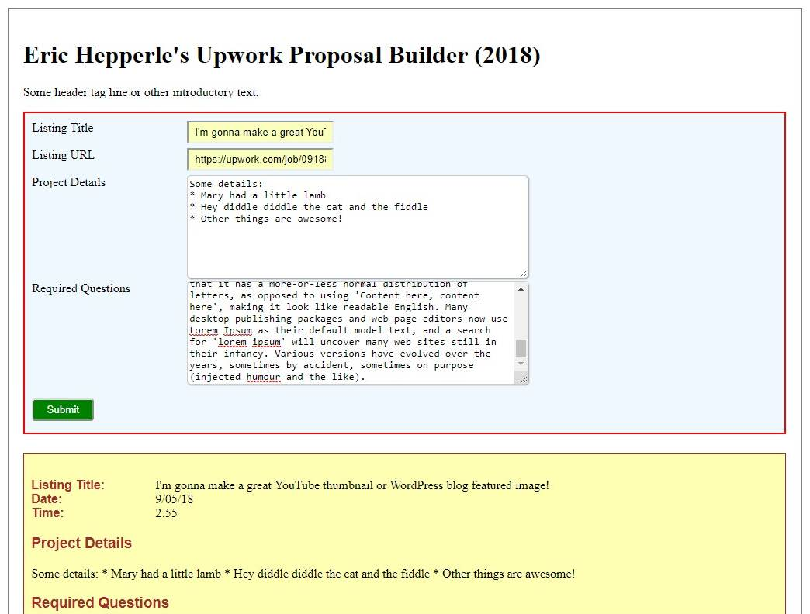

| Program Name         | **App: Upwork Profile Helper** |
| -------------------- | ------------------------------ |
| Public File Name     | **README.md**                  |
| Date Project Started | 05/02/22                       |
| Date Last Versioned  | 10/18/22                       |
| Version              | 1.10                           |
| Programmer           | Eric Hepperle                  |

### TECHNOLOGIES:

 

## Purpose:

**<u>App:</u>** Single page app (SPA) to help develop Upwork proposals.

### Description

This is a JavaScript app I conceived and built from scratch using JavaScript ES6, Bootstrap, CSS Grid, and Flexbox.

#### [Live Demo](/#)

### Project Screenshots:

## Usage:

1. N/A
   
## Requires:
* A web browser

## Demonstrates
* JavaScript
* ES6 / ECMAScript 2015
* Vanilla JavaScript
* JavaScript Time & Date
* HTML5/CSS3
* Web Forms
* Self-Submitting Forms
* Single Page App (SPA)

## TAGS
`HTML5` `CSS3` `Single Page App (SPA)` `JavaScript` `ES6` `App` `Vanilla JavaScript` `ECMAScript 2015` `ES2015` `Web Forms` `Forms`

## Resources
- N/A
